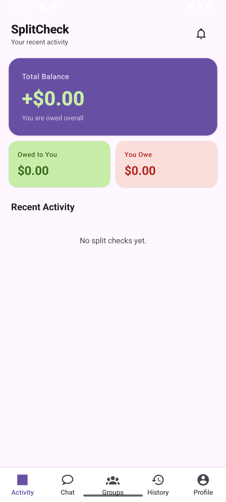
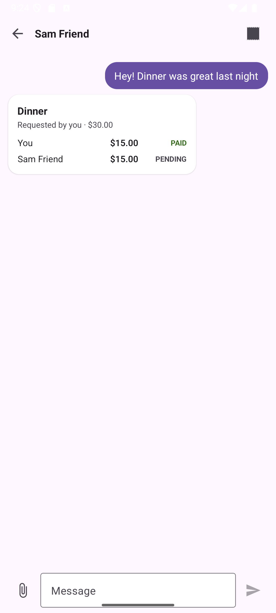
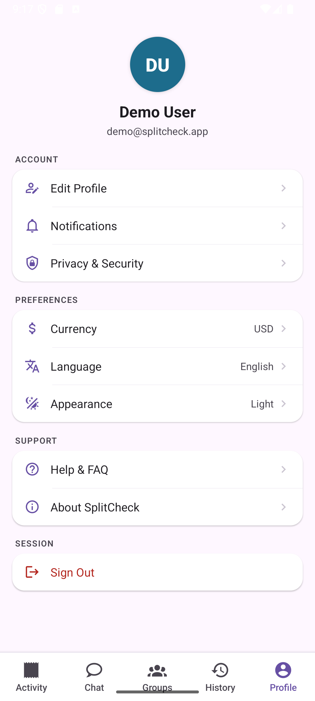
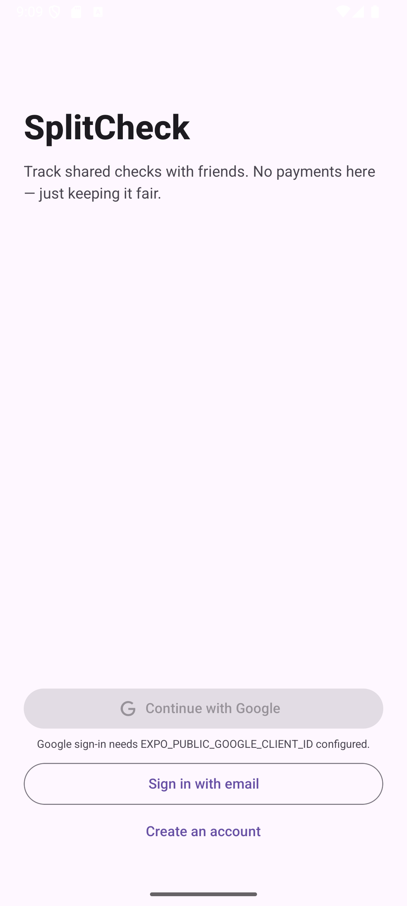
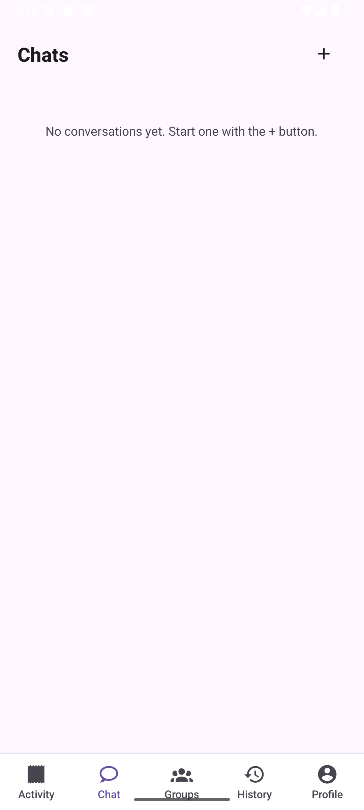

<div align="center">

# SplitCheck

**Track shared checks and receipts with friends — no payments, ever.**





</div>

SplitCheck keeps a running record of who owes what among friends. It never
moves money — there's no payment gateway, no card on file, nothing. A
"check" is just a shared bill with a status per person (`PENDING` /
`PAID` / `DECLINED`), and each person sets their own status themselves.

Sign in with email or Google, message a friend, attach a photo of a
receipt (auto-extracted into line items by Claude), assign items to
people, and send the split. It shows up as a card right in the chat
thread with **Decline** / **Mark as Paid** buttons. Full transaction
history is downloadable as a CSV at any time.

There are three runnable apps sharing one backend — a React Native app,
a React web app, and the Node.js API — all in this one repo.

## User journeys

**1. Create an account.**
Sign up with email + password, or continue with Google. The same backend
account works across the mobile app and the web app.



**2. Message a friend.**
Start a conversation by their email. Messaging is real-time (Socket.IO) —
no refresh needed, on either platform.



**3. Attach a receipt and split it.**
Snap or upload a photo of the receipt. If `ANTHROPIC_API_KEY` is
configured, Claude reads the merchant name and line items off the photo
and pre-fills the split composer — otherwise you add items by hand. Tap
each person's avatar to assign them to an item, then send.

**4. Respond from the chat.**
The split shows up as a card in the thread for everyone in the
conversation. Whoever owes a share sees **Decline** / **Mark as Paid**
buttons; status updates appear live for everyone the moment someone
responds.


**5. Track balances and export history.**
The Activity tab shows running totals — what you're owed, what you owe,
and the net balance — computed from every check you're part of. History
lists settled splits, with a one-tap CSV export of the full transaction
history.

## Monorepo layout

```
splitcheck/
  apps/
    mobile/      Expo / React Native app (iOS, Android, web preview)
    backend/     Node.js + Express + PostgreSQL API, Socket.IO realtime
    web/         React + Vite web app (reuses apps/mobile's UI via react-native-web)
  packages/
    core/        Shared types, zod schemas, API client, csv/currency/avatar utils
    ui/          Shared presentational components (used natively by mobile,
                 and via react-native-web by the web app)
```

Plain npm workspaces — no Turborepo/Nx. `packages/*` are consumed as raw
TypeScript source (no build step) by every app, so a change to a shared
component or type is immediately visible everywhere that imports it.

## Stack

| Layer | Choice | Why |
|---|---|---|
| Mobile | Expo / React Native, Expo Router, react-native-paper | File-based routing, Material You theming, one codebase for iOS/Android |
| Web | React + Vite, react-native-web | Renders the *same* `packages/ui` components used natively on mobile |
| Backend | Node.js, Express, Socket.IO | Lightweight REST + realtime over one HTTP server |
| Database | PostgreSQL via Drizzle ORM | Typed schema/migrations, no native query-engine binary (unlike Prisma) |
| Auth | JWT (access + refresh) + Google ID token verification | Stateless, same flow across all three apps |
| Receipt OCR | Claude (Anthropic API), tool-use for structured output | Forces a JSON shape instead of parsing free text |
| State | Zustand | Minimal boilerplate, same store shape reused between mobile and web |
| Monitoring | Sentry (`@sentry/react-native`, `@sentry/react`, `@sentry/node`) | One DSN per platform, no-ops if unset |

## Prerequisites

- Node.js 20+
- A local PostgreSQL instance (no Docker required) — create an empty
  `splitcheck` database before running migrations
- (Optional) An [Anthropic API key](https://console.anthropic.com/) to enable
  receipt photo → line-item extraction
- (Optional) A Google OAuth "Web application" client ID from the
  [Google Cloud Console](https://console.cloud.google.com/apis/credentials)
  to enable "Continue with Google" — the same client ID is shared by the
  backend, mobile app, and web app
- (Optional) [Sentry](https://sentry.io) DSNs (one per platform) for error/perf
  monitoring

None of the optional integrations are required to run the app — each one is
simply disabled (no-op) when its env var is left blank.

## Setup

```bash
npm install
```

Then copy the `.env.example` in each app and fill in the values:

```bash
cp apps/backend/.env.example apps/backend/.env
cp apps/mobile/.env.example apps/mobile/.env
cp apps/web/.env.example apps/web/.env
```

At minimum, `apps/backend/.env` needs a working `DATABASE_URL` and two random
JWT secrets (the file explains how to generate them).

Run the database migrations once your `DATABASE_URL` is set:

```bash
npm run db:migrate
```

## Running each app

```bash
# Backend API (http://localhost:4000)
npm run dev:backend

# Mobile app (Expo)
npm run dev:mobile

# Web app (http://localhost:5173)
npm run dev:web
```

The mobile app and web app both talk to the backend over `EXPO_PUBLIC_API_URL`
/ `VITE_API_URL` respectively — point both at the same backend instance to
message between a phone and a browser.

For a native Android/iOS build instead of the Expo Go-style dev client,
run `npx expo run:android` (or `run:ios`) from `apps/mobile` directly.

## Architecture notes

- **Money is represented in integer cents** everywhere (DB, API, shared
  types) to avoid floating-point rounding bugs.
- **Realtime**: Socket.IO pushes new messages and check status changes to
  every participant's open sessions live, across mobile and web.
- **Receipts**: uploaded photos are stored on local disk under
  `apps/backend/uploads/` and, if `ANTHROPIC_API_KEY` is set, sent to Claude
  to extract a merchant name, line items, and total — pre-filling the split
  composer.
- **The check creator's own share auto-settles.** There's no UI for paying
  yourself, so the creator's participant row is marked `PAID` at creation
  time — otherwise a check could never be reported as "settled."
- **No payment processing of any kind.** "Mark as Paid" is a status flag a
  participant sets on their own behalf; SplitCheck never touches real money.
